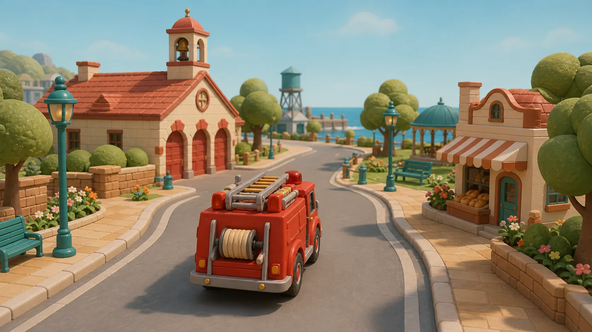
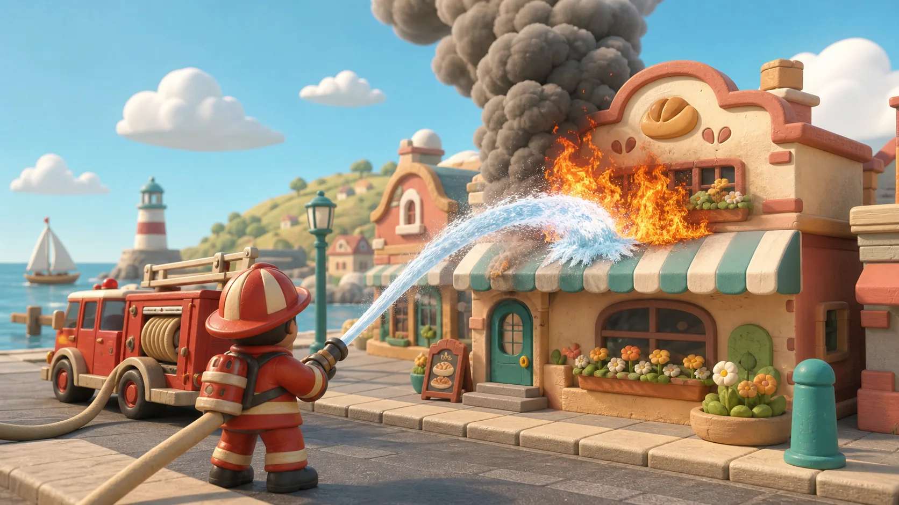
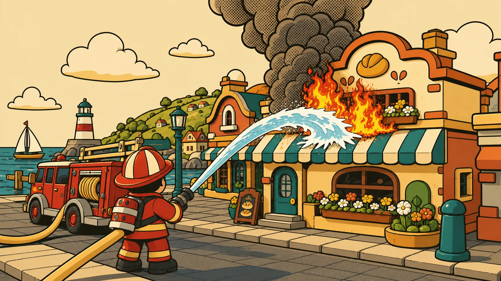

# M3 street-level visual benchmark

**Status:** authoritative target for M3 production art

**Vertical slice:** Harbour Hill fire station → Main Street → Bun & Bee bakery

**Gameplay cameras:** chase while driving; over-the-shoulder while firefighting

These are target frames, not screenshots of the current blockout. They translate
ADR-002 into the third-person game accepted by ADR-005–007. Review the selected
vertical slice against the rules below before expanding production art elsewhere.

## Quiet free roam — primary toy-diorama style

- The truck fills the lower centre third and reads from its silhouette before
  small apparatus detail.
- A child can describe the route with landmarks: bell tower, bakery awning,
  water tower, and harbour.
- Streets stay broad and forgiving, but kerbs, flowers, benches, lamps, rooflines,
  and waterfront edges make the route enjoyable when nothing is burning.
- Quiet-world colour is warm and moderately saturated. Nothing competes with
  future fire and smoke for the strongest contrast or motion.

## Active exterior fire — primary toy-diorama style

- The firefighter fills the lower-left shoulder position; the target and water
  arc stay readable without precision camera control.
- Fire lives only on the exterior awning and facade. No interior or civilian is
  implied, and the firefighter's stance is capable rather than endangered.
- Flame, water, and the tall fluffy smoke column are the brightest, highest-motion
  signals. Scenic flowers and shop detail remain subordinate.
- Damage can become scorched, sagged, or slumped property, but the material
  language stays rounded, tactile, and toy-safe.

## The same active frame — supported ink treatment

Shared between styles:

- camera, scale, silhouettes, object placement, exterior-only rules, and gameplay
  readability;
- the firefighter, truck, target, water arc, and smoke column hierarchy;
- semantic simulation state and all interaction logic.

Ink-specific:

- three-band cel shading, a warm parchment ground, dark-brown silhouette outlines,
  selective interior contours, graphic flame/water shapes, and halftone only inside
  smoke;
- sharper edges and higher state contrast, without extra HUD, different geometry,
  or style-specific gameplay.

## Street-level production rules

| Area | Pass | Fail |
| --- | --- | --- |
| Scale | Chunky hero shapes readable at normal chase/shoulder distance | Thin realistic detail needed to identify the truck or firefighter |
| Shape | Rounded bevels, softened rooflines, clustered foliage | Raw boxes, razor kerbs, uniform rectangular skyline |
| Material | Matte painted wood/soft plastic with restrained tactile grain | Photoreal grime, chrome noise, or flat unlit prototype surfaces |
| Light | High-key daylight, soft directional shadows, grounded contact blobs | Harsh black shadow fields or low-key danger lighting |
| Colour | Quiet town is warm and controlled; incident signals own peak contrast | Every shop, prop, and landmark competes at maximum saturation |
| Navigation | Bell tower, bakery awning, water tower, and harbour form a memorable route | Progress depends on a number, label, or permanent arrow |
| Fire | Rounded flame, visible water contact, tall readable smoke | Fire hidden inside a building or represented mainly by UI |
| Tone | Exciting property spectacle with a confident, safe firefighter | People in danger, player harm, panic, or realistic disaster imagery |

## Hero silhouette floor

- **Truck:** one compact red body, high cream roof gear, four oversized dark wheels,
  and a readable rear hose reel. Small fittings are polish, never identification.
- **Firefighter:** large helmet brim, compact torso, short stable legs, two-handed
  nozzle pose, and a bright water arc. The hose action must read at thumbnail size.
- At 200 px image width, a reviewer should still distinguish truck, firefighter,
  fire target, and smoke direction without text.

## Vertical-slice sign-off

Capture the live fire-station-to-bakery route in both cameras and compare it beside
these frames. The slice passes when every row in the table has observable evidence,
the scene remains below the render budget in both styles, and covering all HUD text
does not break navigation or the hose loop.

The reference images were generated specifically for this benchmark from the
accepted game constraints. They define composition and visual language; they are
not promises of per-pixel assets or hidden mechanics.
